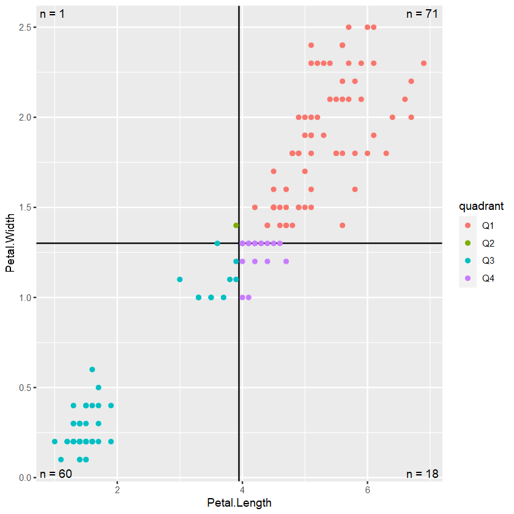

```R
library(dplyr)
library(ggplot2)
```


```R
# Step 1: Calculate the midpoint for the x-axis from the iris data column Petal.Length
x_mid <- mean(c(max(iris$Petal.Length, na.rm = TRUE), min(iris$Petal.Length, na.rm = TRUE)))

# Step 2: Calculate the midpoint for the y-axis from the iris data column Petal.Width
y_mid <- mean(c(max(iris$Petal.Width, na.rm = TRUE), min(iris$Petal.Width, na.rm = TRUE)))

# Step 3: Create a new column 'quadr ant' in the iris data based on specified conditions
iris2 <- iris %>% mutate(quadrant = case_when(Petal.Length > x_mid & Petal.Width > y_mid ~ "Q1",
                                              Petal.Length <= x_mid & Petal.Width > y_mid ~ "Q2",
                                              Petal.Length <= x_mid & Petal.Width <= y_mid ~ "Q3", TRUE ~ "Q4"))

# Step 4: Create a summary table 'iris_labels' with counts for each quadrant and positioning information for labels
iris_labels <- iris2 |> 
  count(quadrant) |> 
  mutate(x = if_else(quadrant %in% c("Q1", "Q4"), Inf, -Inf),
         hjust = if_else(quadrant %in% c("Q1", "Q4"), 1, 0),
         y = if_else(quadrant %in% c("Q1", "Q2"), Inf, -Inf),
         vjust = if_else(quadrant %in% c("Q1", "Q2"), 1, 0)) 

# Step 5: Create a scatter plot with quadrant color-coding, vertical and horizontal lines at midpoints, and data points
ggplot(iris2, aes(x = Petal.Length, y = Petal.Width, color = quadrant)) +
    geom_vline(xintercept = x_mid) +
    geom_hline(yintercept = y_mid) +
    geom_point() +
    # Step 6: Add labels to the plot based on the summary table 'iris_labels'
    geom_label(data = iris_labels,
    aes(label = paste0("n = ", n),
        x = x, y = y, color = NULL,
        hjust = hjust, vjust = vjust),
               fill = NA, label.size = 0,
               show.legend = FALSE)
```


    

    


```R
# Save the plot in desired format
ggsave("qudrant_plot.png", width = 6, height = 6, dpi = 300)
```

